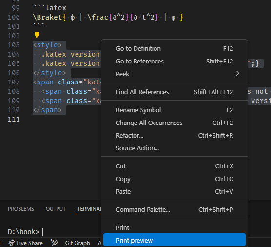

[English](README.md) | [Français](README.fra.md) | [اردو](README.urd.md) | [Italiano](README.ita.md) | [Íslenska](README.isl.md) | [简体中文](README.zho.md)

 

## Impression multiplateforme

Les travaux d’impression sont rendus sous forme de code HTML stylisé et servis à partir d’un serveur Web intégré. Votre navigateur Web local est lancé pour charger le travail d’impression et vous offrir des options d’impression telles que le format de papier, l’orientation de la page et la taille de la marge.

Donc, si vous avez un navigateur local qui peut imprimer, et VS Code peut le lancer, vous pouvez imprimer.

## Code source

 

## Markdown

 

## Expérience utilisateur classique

L’icône d’impression de la barre d’outils imprime le contenu de l’éditeur actif. Cela peut différer du fichier enregistré lorsqu’il y a des modifications non enregistrées, et bien sûr, vous pouvez imprimer un nouveau document qui n’a jamais été enregistré.

Si vous avez une sélection de texte qui s’étend au moins un saut de ligne, vous pouvez clic-droit sur la texte et choisir `Imprimer` dans le menu contextuel pour envoyer seulement la sélection à l’imprimante. En l’absence d’une sélection multiligne, le document complet sera imprimé. Vous pouvez contrôler la position de `Imprimer` dans ce menu, ou la supprimer complètement.

Vous pouvez également clic-droit sur un fichier dans le volet de l’explorateur de fichiers et choisir Imprimer dans le menu contextuel.

## Très configurable

Il existe différents paramètres. La plupart d’entre eux, vous avez juste besoin de lire les descriptions sur la page des paramètres, mais nous sommes de la vieille école et [nous avons écrit un manuel.] (doc/manual.fra.md) Si les choses ne vont pas bien, vous devriez peut-être le lire. Si vous rencontrez des problèmes de première utilisation, le manuel contient un [guide de dépannage] (doc/manual.fra.md#Dépannage).

Quelques-unes des choses que vous pouvez configurer:

- la palette de couleurs utilisée pour la coloration syntaxique
- si vous voulez ou non des numéros de ligne
- un navigateur autre que votre navigateur par défaut, à utiliser lors de l’impression
- interligne (laissez-vous plus de place pour l’annotation manuscrite du code)
